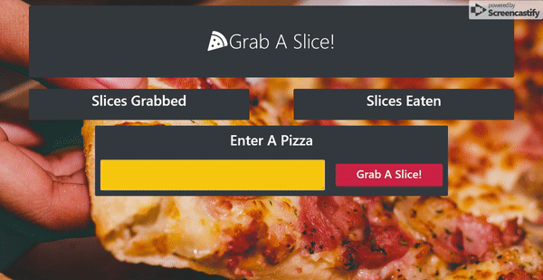

# Grab A Slice!

An app for logging pizza slices. It uses a MySQL database to keep track of the pizza items. The user is able to log a pizza by typing a pizza name into the textarea and clicking on the "Grab A Slice" button. The pizza slices is populated in the "Slices Grabbed" column. Clicking on the "Devour" button will move the pizza slice over to the "Slices Eaten" column. The user may then click the "Grab Another Slice" button to move the slice back to the "Grab A Slice" button, or click the "Throw Plate Away" button to delete the pizza slice.

## Deployed Link

https://frozen-atoll-51404.herokuapp.com/

## Code Snipets

```javascript
var orm = {
    selectAll: function(tableName, cb){
        connection.query(
            "SELECT * FROM ??;",
            [tableName],
            function(err, res){
                if (err) throw err;
                cb(res);
            }
        );
    },
```
The SQL queries are ran with a custom orm. The orm function shown above is used to send a request to the database to return all the columns within a table.

```javascript
var pizza = {
    selectAll: function(cb){
        orm.selectAll("pizzas", function(res){
            cb(res);
        });
    },
```
In order to get information specifically from the "pizzas" table, the app uses a model that calls the orm and sends it the table name.

```javascript
router.get("/", function(req, res){
    pizza.selectAll(function(data){
        var handlerbarsObject ={
            pizzas: data
        };

        res.render("index", handlerbarsObject);
    });
});
```

This is one of the functions executed by the server. In this case, the function is ran when the user accesses the landing page. The server executes a request using the pizza model to get all that table's information. It then uses that data to render the html using handlebars.

```handlebars
<div class="col-12 col-lg-5 bg-dark rounded">
    <h1 class="text-center text-white py-2">Slices Grabbed</h1>
    <div class="container">
        <div class="row">
            {{#each pizzas}}
                {{#unless devoured}}
                <div class="col-12 col-xl-6 mb-4">
                    <div class="card bg-warning">
                        <div class="card-body text-center">
                            <h3 class="card-title">{{pizza_name}}</h3>
                            <button class="btn btn-lg btn-danger change-devoured" data-id={{id}} data-devoured={{devoured}}>
                                <i class="fas fa-pizza-slice mr-1"></i>Devour!
                            </button>
                        </div>
                    </div>
                </div>
                {{/unless}}
            {{/each}}
        </div>
    </div>
</div>
```
All the HTML is prerendered using handlebars. Handlebars uses all the information that was passed to it from the database and inputs it into an HTML template. When it is finished, it sends the completed HTML file to the client.

## Live Demo



## Built With

* [express](https://www.npmjs.com/package/express)
* [express-handlebars](https://www.npmjs.com/package/express-handlebars)
* [mysql](https://www.npmjs.com/package/mysql)
* [JawsDB](https://www.jawsdb.com/)
* [node.js](https://nodejs.org/en/)
* [Bootstrap](https://getbootstrap.com/)
* [HTML](https://developer.mozilla.org/en-US/docs/Web/HTML)
* [CSS](https://developer.mozilla.org/en-US/docs/Web/CSS)
* [Javascript](https://developer.mozilla.org/en-US/docs/Web/JavaScript)
* [Git](https://git-scm.com/)
* [GitHub](https://github.com/)
* [VSCode](https://code.visualstudio.com/)

## Author

**Yalí Miranda** 

* [Github](https://github.com/yjmiranda)
* [LinkedIn](https://www.linkedin.com/in/yal%C3%AD-miranda-8b4b94199/)
* [Portfolio](https://yjmiranda.github.io/portfolio/)